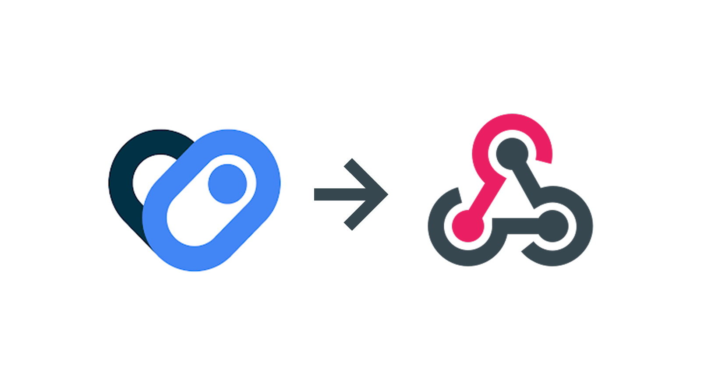
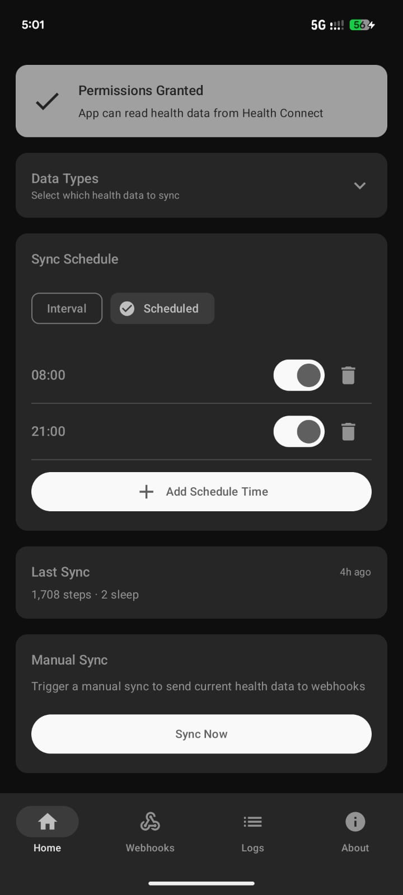
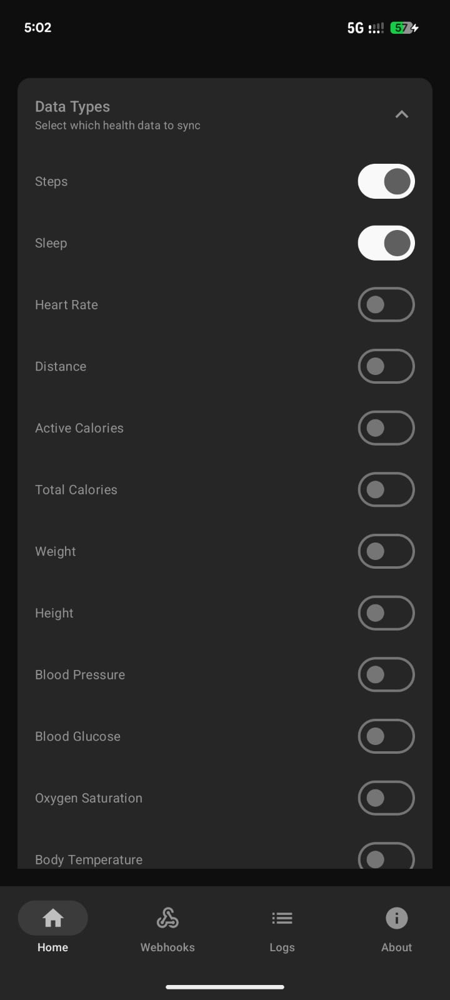
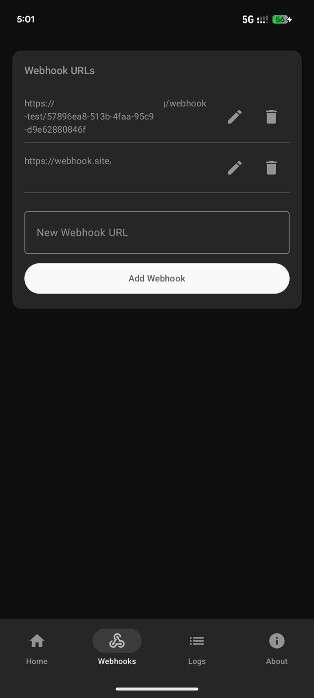

# Health Connect to Webhook (Beta)



An Android app that bridges Google Fit, Samsung Health, Fitbit, and other health apps to your webhooks via Health Connect APIs, enabling seamless integration with your custom endpoints and services.

## Overview

HC Webhook connects Google Health Connect to your webhook infrastructure. Health Connect aggregates health data from apps like Google Fit, Samsung Health, Fitbit, and more into a unified API. This app reads that aggregated data and sends it to your configured webhook URLs at customizable intervals, making it easy to integrate health data from multiple sources into your own systems, analytics platforms, or third-party services.

## How It Works

1. **Health Apps** (Google Fit, Samsung Health, Fitbit, etc.) sync data to **Health Connect**
2. **Health Connect** aggregates all health data into a unified API
3. **HC Webhook** reads data from Health Connect at configured intervals
4. **HC Webhook** sends the data to your configured **webhook URLs**
5. Your **custom services** receive and process the health data

## Supported Health Apps

Health Connect aggregates data from these popular health and fitness apps:

- **Google Fit** - Activity tracking, workouts, and health metrics
- **Samsung Health** - Comprehensive health and fitness tracking
- **Fitbit** - Activity, sleep, and heart rate data
- **MyFitnessPal** - Nutrition and calorie tracking
- **Strava** - Running and cycling activities
- **Nike Run Club** - Running activities and workouts
- **Withings** - Weight, blood pressure, and activity tracking
- **Garmin Connect** - Fitness and health data from Garmin devices
- **Polar** - Heart rate and fitness tracking
- **Oura** - Sleep, activity, and recovery data
- **And many more...** - Any app that syncs to Health Connect

> **Note**: You don't need to install all these apps. Just ensure the apps you use are syncing their data to Health Connect, and HC Webhook will automatically access that unified data.

## Screenshots

|                         Homescreen                         |                         Data Types                         |                         Webhook Logs                         |
| :--------------------------------------------------------: | :--------------------------------------------------------: | :----------------------------------------------------------: |
|  |  |  |

## Features

- 🔄 **Automated Background Sync** - Configurable sync intervals (minimum 15 minutes) using WorkManager
- 🎯 **Selective Data Types** - Choose which health data types to sync (17 supported types)
- 🔗 **Multiple Webhooks** - Send data to multiple webhook URLs simultaneously
- 📊 **Manual Sync** - Trigger immediate data synchronization on demand
- 📝 **Webhook Logs** - View detailed logs of all webhook requests and responses
- 🔐 **Permission Management** - Granular Health Connect permission handling
- 🎨 **Modern UI** - Built with Jetpack Compose and Material 3 design
- ⚡ **Real-time Status** - Visual indicators for permission status and sync state
- 💬 **Feedback** - Easy access to provide feedback and suggestions through the app menu

## Supported Health Data Types

The app supports reading and syncing the following health data types from Health Connect:

1. **Steps** - Daily step count
2. **Sleep** - Sleep sessions with stages
3. **Heart Rate** - Heart rate measurements
4. **Distance** - Distance traveled
5. **Active Calories** - Calories burned during activity
6. **Total Calories** - Total calories burned
7. **Weight** - Body weight measurements
8. **Height** - Height measurements
9. **Blood Pressure** - Systolic and diastolic readings
10. **Blood Glucose** - Blood glucose levels
11. **Oxygen Saturation** - SpO2 measurements
12. **Body Temperature** - Body temperature readings
13. **Respiratory Rate** - Breathing rate measurements
14. **Resting Heart Rate** - Resting heart rate data
15. **Exercise Sessions** - Workout and exercise data
16. **Hydration** - Water intake tracking
17. **Nutrition** - Nutritional information (calories, protein, carbs, fat)

## Requirements

- **Android 8.0 (API 26)** or higher
- **Google Health Connect** app installed and set up
- **Internet connection** for webhook delivery

> **Note**: Health Connect aggregates data from multiple health apps (Google Fit, Samsung Health, Fitbit, etc.). You don't need to directly connect to these apps - just ensure they're syncing to Health Connect, and this app will automatically access that unified data.

## Installation

### From Source

1. Clone this repository:

```bash
git clone https://github.com/mcnaveen/health-connect-webhook
cd health-connect-webhook
```

2. Open the project in Android Studio (Arctic Fox or later recommended)

3. Sync Gradle dependencies

4. Build and run the app on your device or emulator

### Downloads

You can download the latest stable release from the [Releases page](https://github.com/mcnaveen/health-connect-webhook/releases).

### Install via Obtanium

You can easily install and update **HC Webhook** using [Obtainium](https://github.com/ImranR98/Obtainium).

1.  Install **Obtainium** on your Android device.
2.  Tap **"Add App"**.
3.  Enter the repository URL: `https://github.com/mcnaveen/health-connect-webhook`
4.  Allow Obtanium to scan for releases.
5.  Tap **Install** / **Update**.

### From GitHub Actions (Development Builds)

If you want to test the latest development changes (which might be unstable), you can download artifacts from GitHub Actions:

1.  Go to the [Actions](https://github.com/mcnaveen/health-connect-webhook/actions) tab.
2.  Click on the latest successful workflow run.
3.  Scroll down to **Artifacts** and download `app-debug`.

### Building the APK

```bash
./gradlew assembleDebug
```

The APK will be generated at: `app/build/outputs/apk/debug/app-debug.apk`

## Usage

### Initial Setup

1. **Install Health Connect** (if not already installed)
   - Download from [Google Play Store](https://play.google.com/store/apps/details?id=com.google.android.apps.healthdata)

2. **Grant Permissions**
   - Open the app and tap "Grant Permissions"
   - Select the health data types you want to sync
   - Grant the required permissions in Health Connect

3. **Configure Webhooks**
   - Add one or more webhook URLs (must start with `http://` or `https://`)
   - Select which data types to sync
   - Set your preferred sync interval (minimum 15 minutes)

4. **Save Configuration**
   - Tap "Save Configuration" to start automatic syncing

### Manual Sync

- Tap the "Sync Now" button in the Manual Sync section to immediately sync all enabled data types to your webhooks

### Viewing Logs

- Access webhook logs from the menu (⋮) → "Webhook Log"
- View detailed information about each webhook request, including timestamps, status codes, and response data

### Providing Feedback

- Access the feedback form from the menu (⋮) → "Feedback"
- Share your thoughts, suggestions, or report issues directly through the feedback portal

## Configuration

### Sync Interval

- Minimum: 15 minutes
- Recommended: 30-60 minutes for most use cases
- The app uses WorkManager for reliable background syncing

### Webhook Format

The app sends health data to your webhooks in JSON format. Each webhook request includes:

- Timestamp of the sync
- Data type information
- Health data records (filtered to only include new data since last sync)
- Metadata about the sync operation

> **⚠️ Warning**: Internet retry functionality is not implemented yet. If a webhook request fails due to network issues, the app will not automatically retry. Use at your own risk.

### Data Privacy

- All health data remains on your device until explicitly sent to your configured webhooks
- The app only reads data that you explicitly grant permission for
- No data is sent to third-party services except your configured webhooks
- You can revoke permissions at any time through Android settings

## Known Limitations

- ⚠️ **Offline Handling** - The app attempts to retry failed webhook requests briefly (3 retries). If the internet is unavailable, the sync will fail safely without data loss. The data will be automatically retried during the next scheduled sync interval.
- 🕒 **48-Hour Lookback** - To ensure performance and relevance, the app scans for health data within a rolling 48-hour window. Data older than 48 hours may not be synced if the app was not running or configured during that time.

## Technical Details

### Architecture

- **Language**: Kotlin
- **UI Framework**: Jetpack Compose
- **Health Data**: Health Connect SDK (AndroidX)
- **Background Work**: WorkManager
- **Networking**: OkHttp
- **Serialization**: Kotlinx Serialization

### Key Components

- `MainActivity` - Main Entry Point & Navigation Host
- `HealthConnectManager` - Handles Health Connect data reading
- `SyncManager` - Manages data synchronization logic
- `SyncWorker` - Background worker for periodic syncing
- `WebhookManager` - Handles webhook HTTP requests
- `PreferencesManager` - Manages app configuration and preferences
- `ScheduledSyncManager` - Manages AlarmManager for custom schedules
- `ScheduledSyncReceiver` - Receives alarm broadcasts to trigger syncs
- `ConfigurationScreen` - Main settings UI
- `LogsScreen` - Displays webhook request/response logs

### Permissions

The app requires the following permissions:

- Health Connect read permissions (for each selected data type)
- `READ_HEALTH_DATA_IN_BACKGROUND` - For background data access
- `INTERNET` - For webhook delivery

## Development

### Project Structure

```
app/
├── src/
│   ├── main/
│   │   ├── java/com/hcwebhook/app/
│   │   │   ├── MainActivity.kt          # Main Entry Point
│   │   │   ├── HCWebhookApplication.kt  # Application Class
│   │   │   ├── HealthConnectManager.kt  # Health Connect Logic
│   │   │   ├── SyncManager.kt           # Sync Logic & Scheduling
│   │   │   ├── SyncWorker.kt            # WorkManager Background Task
│   │   │   ├── WebhookManager.kt        # HTTP Client
│   │   │   ├── PreferencesManager.kt    # DataStore Preferences
│   │   │   ├── ScheduledSyncManager.kt  # Alarm Manager Logic
│   │   │   ├── ScheduledSyncReceiver.kt # Broadcast Receiver
│   │   │   ├── components/              # UI Components
│   │   │   ├── screens/                 # Composable Screens
│   │   │   └── ui/                      # Theme & Color
│   │   └── res/                         # Resources
└── build.gradle.kts                     # App-level build config
```

### Building

```bash
# Debug build
./gradlew assembleDebug

# Release build
./gradlew assembleRelease
```

## Contributing

Contributions are welcome! Please feel free to submit a Pull Request.

1. Fork the repository
2. Create your feature branch (`git checkout -b feature/AmazingFeature`)
3. Commit your changes (`git commit -m 'feat: Add some AmazingFeature'`)
4. Push to the branch (`git push origin feature/AmazingFeature`)
5. Open a Pull Request

## License

This project is licensed under the [Apache License, Version 2.0](LICENSE).

```text
   Copyright 2026 MC.Naveen

   Licensed under the Apache License, Version 2.0 (the "License");
   you may not use this file except in compliance with the License.
   You may obtain a copy of the License at

       http://www.apache.org/licenses/LICENSE-2.0

   Unless required by applicable law or agreed to in writing, software
   distributed under the License is distributed on an "AS IS" BASIS,
   WITHOUT WARRANTIES OR CONDITIONS OF ANY KIND, either express or implied.
   See the License for the specific language governing permissions and
   limitations under the License.
```

## Privacy & Security

- HC Webhook does not collect, store, or transmit any personal data to third-party services
- All health data remains on your device until sent to your configured webhooks
- Webhook URLs are stored locally on your device
- You have full control over which data types are synced and where they are sent

## Support

For issues, feature requests, or questions, you can:

- Open an issue on GitHub
- Provide feedback directly through the app: Menu (⋮) → "Feedback" or visit [https://hc-webhook.feedbackjar.com/](https://hc-webhook.feedbackjar.com/)

## Acknowledgments

- Built with [Health Connect](https://developer.android.com/guide/health-and-fitness/health-connect) by Google
- UI designed with [Jetpack Compose](https://developer.android.com/jetpack/compose)
- Powered by [WorkManager](https://developer.android.com/topic/libraries/architecture/workmanager) for reliable background processing

---

**Note**: This app requires Health Connect to be installed and properly configured on your device. Health Connect is available on Android 14+ devices or can be installed from the Play Store on compatible devices.
